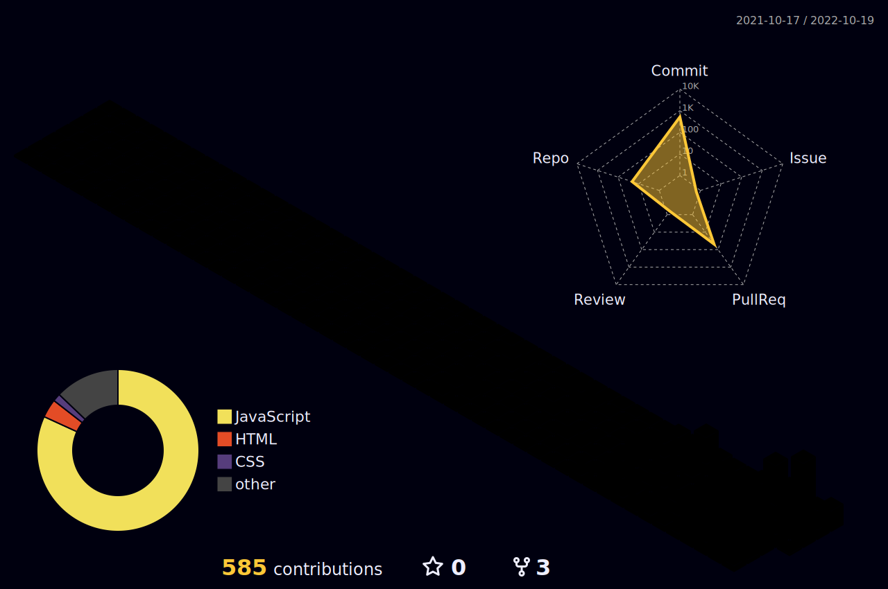

### Hi there 👋


<p align="center">
<a href="https://wakatime.com/@5c1afe64-ab84-4e81-9e29-073a6f822c3c"></a>
<a href="https://hits.seeyoufarm.com"></a>
</p>

<br>

<h3 align="center"> ⚡ CONTACT ⚡ </h3>

<p align="center">
  <a href="https://sw1104.github.io"></a>&nbsp
  <a href="mailto:sangw1104@gmail.com"></a>
</p>

<br>

<h3 align="center"> 🚀 SKILL 🚀 </h3>

<p align="center">
  </a>&nbsp 
  </a>&nbsp 
  </a>&nbsp 
  <br>
  </a>&nbsp 
  </a>&nbsp 
  </a>&nbsp 
  </a>&nbsp 
</p>

<br>

<!--START_SECTION:waka-->


**🐱 My GitHub Data** 

> 🏆 433 Contributions in the Year 2022
 > 
> 📦 42.5 kB Used in GitHub's Storage 
 > 
> 🚫 Not Opted to Hire
 > 
> 📜 17 Public Repositories 
 > 
> 🔑 4 Private Repositories  
 > 
**I'm an Early 🐤** 

```text
🌞 Morning    37 commits     ███░░░░░░░░░░░░░░░░░░░░░░   11.56% 
🌆 Daytime    124 commits    █████████░░░░░░░░░░░░░░░░   38.75% 
🌃 Evening    129 commits    ██████████░░░░░░░░░░░░░░░   40.31% 
🌙 Night      30 commits     ██░░░░░░░░░░░░░░░░░░░░░░░   9.38%

```
📅 **I'm Most Productive on Sunday** 

```text
Monday       46 commits     ███░░░░░░░░░░░░░░░░░░░░░░   14.37% 
Tuesday      46 commits     ███░░░░░░░░░░░░░░░░░░░░░░   14.37% 
Wednesday    34 commits     ██░░░░░░░░░░░░░░░░░░░░░░░   10.62% 
Thursday     58 commits     ████░░░░░░░░░░░░░░░░░░░░░   18.12% 
Friday       43 commits     ███░░░░░░░░░░░░░░░░░░░░░░   13.44% 
Saturday     28 commits     ██░░░░░░░░░░░░░░░░░░░░░░░   8.75% 
Sunday       65 commits     █████░░░░░░░░░░░░░░░░░░░░   20.31%

```


📊 **This Week I Spent My Time On** 

```text
⌚︎ Time Zone: Asia/Seoul

💬 Programming Languages: 
Markdown                 13 mins             ████████████████████████░   98.81% 
JavaScript               0 secs              ░░░░░░░░░░░░░░░░░░░░░░░░░   0.94% 
JSON                     0 secs              ░░░░░░░░░░░░░░░░░░░░░░░░░   0.21% 
YAML                     0 secs              ░░░░░░░░░░░░░░░░░░░░░░░░░   0.02% 
Other                    0 secs              ░░░░░░░░░░░░░░░░░░░░░░░░░   0.02%

🔥 Editors: 
VS Code                  13 mins             █████████████████████████   100.0%

🐱‍💻 Projects: 
sw1104.github.io         13 mins             ████████████████████████░   98.83% 
minister_token           0 secs              ░░░░░░░░░░░░░░░░░░░░░░░░░   0.64% 
miniter_token_FE         0 secs              ░░░░░░░░░░░░░░░░░░░░░░░░░   0.53%

💻 Operating System: 
Mac                      13 mins             █████████████████████████   100.0%

```

**I Mostly Code in JavaScript** 

```text
JavaScript               6 repos             ██████████████████░░░░░░░   75.0% 
HTML                     1 repo              ███░░░░░░░░░░░░░░░░░░░░░░   12.5% 
CSS                      1 repo              ███░░░░░░░░░░░░░░░░░░░░░░   12.5%

```


**Timeline**

 


 Last Updated on 06/10/2022 01:47:14 UTC
<!--END_SECTION:waka-->

<br>

<a href="https://github.com/sw1104">
  
</a>
<a href="https://github.com/sw1104">
  
</a>



<!--
**sw1104/sw1104** is a ✨ _special_ ✨ repository because its `README.md` (this file) appears on your GitHub profile.

Here are some ideas to get you started:

- 🔭 I’m currently working on ...
- 🌱 I’m currently learning ...
- 👯 I’m looking to collaborate on ...
- 🤔 I’m looking for help with ...
- 💬 Ask me about ...
- 📫 How to reach me: ...
- 😄 Pronouns: ...
- ⚡ Fun fact: ...
-->
